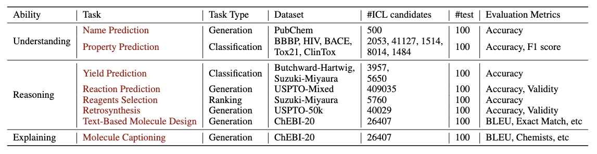
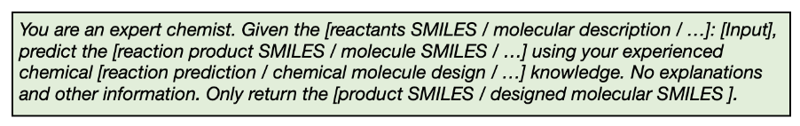
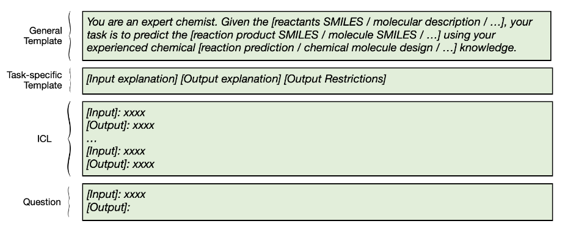

<h1 align="center">  ⚛ ChemLLMBench ⚛  </h1>

The official repository of **"What can Large Language Models do in chemistry? A comprehensive benchmark on eight tasks"**. https://arxiv.org/abs/2305.18365 


## 🆕 News
- \[**Sep 2023**\] Our paper has been accepted to **NeurIPS 2023 Datasets and Benchmarks Track!**
- \[**Sep 2023**\] We released the second version (v2) of our paper, we added extra LLMs **(GPT-4, GPT-3.5, Davinci-003, LLama2, Galactica)** experiments; more baselines, and more investigations on **SELFIES**, and label interpretation!
- \[**May 2023**\] We released the first version (v1) of our paper! Very glad to share our investigations and insights about LLM in chemistry!


## 💡 Tasks Overview



## 📌 Prompt
The followings are our prompt used in the paper. It's extremely easy to try your own designed prompt! Only need to change the prompt in the Jupyter code of each task and then we can see the results and performance.
### Zero-shot Prompt 



### ICL Prompt



## 📊 Dataset
The datasets of some tasks are already uploaded in this repository.
Becuase of the size limit, please download these datasets according to the link. After downloading these datasets, please move these datasets to the corresponding folder and then you can run our Jupyter code of each task.
| Dataset  | Link  |  Reference | 
|  ----  | ----  |  ----  |
| USPTO_Mixed  | [download](https://az.app.box.com/s/7eci3nd9vy0xplqniitpk02rbg9q2zcq/folder/144882141119) |  https://github.com/MolecularAI/Chemformer     | 
| USPTO-50k  | [download](https://az.app.box.com/s/7eci3nd9vy0xplqniitpk02rbg9q2zcq/folder/144882141119) |  https://github.com/MolecularAI/Chemformer     |
| ChEBI-20   | [download](https://github.com/blender-nlp/MolT5/tree/main/ChEBI-20_data)  |   https://github.com/blender-nlp/MolT5   |
| Suzuki-miyaura |[download](https://github.com/seokhokang/reaction_yield_nn/blob/main/data/dataset_2_0.npz)| https://github.com/seokhokang/reaction_yield_nn|
|Butchward-Hariwig|[download](https://github.com/seokhokang/reaction_yield_nn/blob/main/data/dataset_1_0.npz)|https://github.com/seokhokang/reaction_yield_nn|
| BBBP,BACE,HIV,Tox21,Clintox| [download](https://github.com/hwwang55/MolR/tree/master/data)|https://github.com/hwwang55/MolR|
| PubChem | [download](https://github.com/ChemFoundationModels/ChemLLMBench/blob/main/data/name_prediction/pubchem.csv) | https://github.com/ChemFoundationModels/ChemLLMBench/blob/main/data/name_prediction/pubchem.csv | 


## 🤗 Cite us 
```text
@misc{guo2023gpt,
      title={What indeed can GPT models do in chemistry? A comprehensive benchmark on eight tasks}, 
      author={Taicheng Guo and Kehan Guo and Bozhao Nan and Zhenwen Liang and Zhichun Guo and Nitesh V. Chawla and Olaf Wiest and Xiangliang Zhang},
      year={2023},
      eprint={2305.18365},
      archivePrefix={arXiv},
      primaryClass={cs.CL}
}
```


