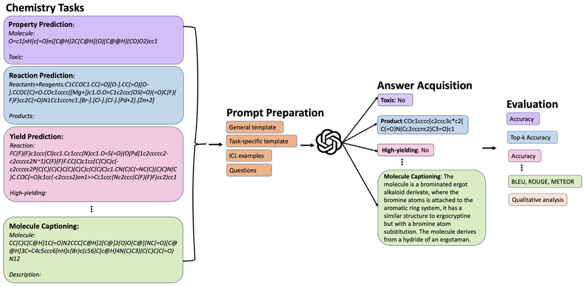

# ChemLLMBench

The official repository of "What indeed can GPT models do in chemistry? A comprehensive benchmark on eight tasks". https://arxiv.org/abs/2305.18365 

Thanks for your attention! We're currently clean the code and data and we will release them soon.

